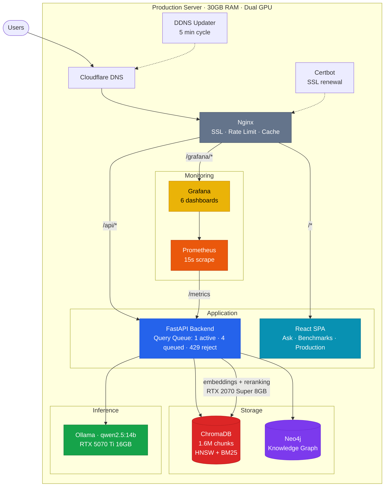
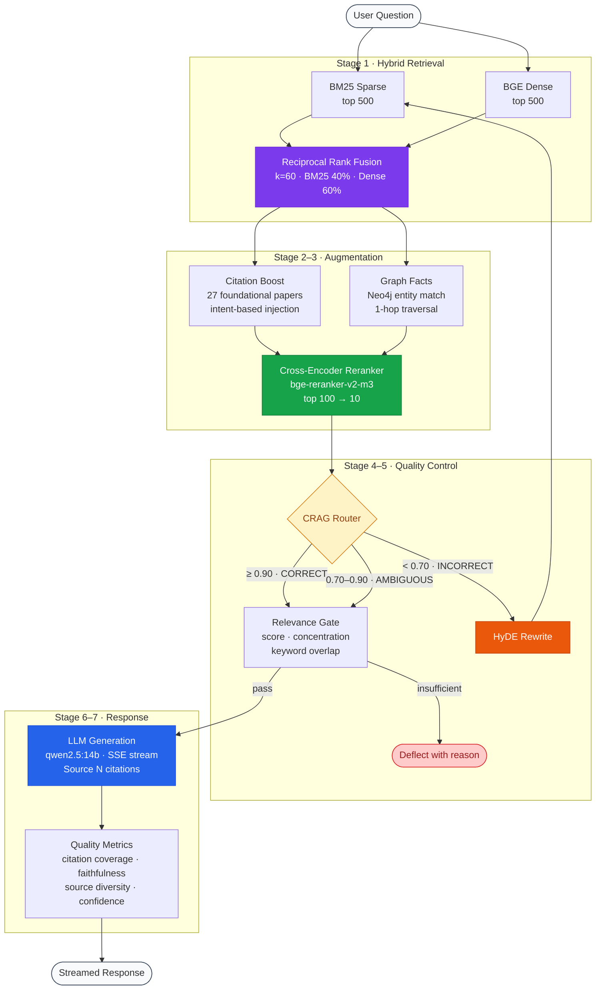

# RAG-Bench

[](https://github.com/nblomerus/rag-bench/actions/workflows/ci.yml)


A self-hosted RAG system for querying 21,000+ AI/ML research papers. Hybrid retrieval (BM25 + dense embeddings + cross-encoder reranking), knowledge graph augmentation (Neo4j), corrective RAG with confidence routing, LLM generation with inline source citations, and a full evaluation framework — running on a dual-GPU machine.

**Live demo:** [ragbench.co.za](https://ragbench.co.za)

---

## Features

- **Hybrid retrieval** — BM25 sparse + BGE dense embeddings fused with Reciprocal Rank Fusion, reranked by cross-encoder (`BAAI/bge-reranker-v2-m3`)
- **GraphRAG** — Neo4j knowledge graph with entity extraction, community detection, and graph-augmented retrieval
- **Corrective RAG (CRAG)** — Confidence routing with HyDE rewriting for low-confidence queries
- **Grounded answers** — LLM generates responses with `[Source N]` citations; citation boost for foundational papers
- **Streaming** — Server-Sent Events with queue position feedback and pipeline stage updates
- **Evaluation suite** — 160-entry benchmark + RAGTruth with retrieval, citation, faithfulness, and relevance metrics
- **Monitoring** — Prometheus metrics + Grafana dashboards with queue depth, rejection rates, and user tracking
- **Production-hardened** — OOM protection, query queue limits (429 backpressure), curl-based healthchecks, DDNS auto-update
- **Self-contained** — Docker Compose brings up the full stack; no external services required

---

## Architecture

### System Overview



### Query Pipeline



### Codebase

```
rag_bench/
├── api/             FastAPI server, Pydantic schemas, SSE streaming
├── core/
│   ├── chunker.py       Semantic chunking with equation preservation
│   ├── enricher.py      Contextual enrichment + acronym expansion
│   ├── embedder.py      BGE embedding + ChromaDB indexing
│   ├── retriever.py     Hybrid BM25 + dense retrieval with RRF
│   ├── generator.py     LLM generation with math post-processing
│   ├── crag.py          Corrective RAG (confidence routing + HyDE)
│   ├── graph_store.py   Neo4j wrapper (MERGE dedup, batch writes)
│   ├── graph_retriever.py  Graph-augmented retrieval
│   ├── entity_extractor.py LLM-based triple extraction
│   ├── citation_boost.py   Foundational paper injection
│   ├── agent.py         RAG agent (retrieve-first-then-escalate)
│   └── pipeline.py      Pipeline orchestration
├── eval/            Benchmarks (160 entries), metrics, RAGTruth
├── observability/   Prometheus metrics, structured logging, tracker
├── cli/             Pipeline & query CLI tools
└── utils/           Text processing utilities

frontend/            React 18 SPA (Vite + Tailwind CSS)
monitoring/          Prometheus config + Grafana dashboards
ddns/                Cloudflare DDNS auto-updater
scripts/             ArXiv scraper, knowledge graph builder
tests/               Unit tests (90%+ coverage enforced)
```

---

## How It Works

### Ingestion

Papers are scraped from ArXiv and HuggingFace, then chunked, embedded, and indexed.

```bash
python scripts/scrape_arxiv.py                  # ~170 landmark papers
python scripts/scrape_arxiv.py --mode extended  # ~15,000+ across 18 topics
python -m rag_bench.cli.pipeline --hybrid       # Chunk, embed, index
```

**Chunking** — 1024-char chunks with 128-char overlap. Equations (`$$...$$`, `\begin{align}`) and tables (`|...|`) are preserved across boundaries. Noise sections (references, acknowledgments) are filtered. Each chunk gets a contextual prefix: `"{Title} — {Section}\n\n"`.

**Embedding** — `BAAI/bge-base-en-v1.5` (768-dim), batched at 254, L2-normalized, stored in ChromaDB with HNSW cosine indexing. Metadata: `chunk_id`, `arxiv_id`, `section`, `source_display`, categories.

### Retrieval Pipeline

**Stage 1: Hybrid Retrieval** — BM25 (`k1=1.5`, `b=0.75`) and BGE dense each return top 500, fused via RRF (`k=60`, BM25 40% / dense 60%).

**Stage 2: Citation Boost** — Query intent classified as foundational/recent/balanced. 27 curated landmark papers (Attention Is All You Need, BERT, GPT-3, LoRA, etc.) injected with 1.3x-2.0x boost.

**Stage 3: Graph Augmentation** — Entities matched against Neo4j knowledge graph, 1-hop neighborhood traversed, relevant graph facts injected into the candidate pool.

**Stage 4: Reranking** — Top 100 candidates rescored by `BAAI/bge-reranker-v2-m3` cross-encoder. Final top 10 returned.

**Stage 5: CRAG Routing** — Confidence scored via reranker output. CORRECT (>=0.90): pass through. AMBIGUOUS (0.70-0.90): filter weak results. INCORRECT (<0.70): HyDE rewrite and retry.

**Stage 6: Relevance Gate** — Min score, concentration, keyword overlap checks. Deflects low-confidence queries with reason.

**Stage 7: Generation** — `qwen2.5:14b` via Ollama, streamed via SSE. 11-rule system prompt enforcing `[Source N]` citation discipline. Math post-processing (Greek Unicode -> LaTeX, subscript/superscript wrapping).

### Quality Metrics (per response, no LLM needed)

| Metric | How |
|--------|-----|
| Retrieval confidence | Score gap ratio between top-1 and top-2 |
| Citation coverage | % of provided sources actually cited |
| Citation density | `[Source N]` markers per 100 words |
| Unsupported claims | Heuristic count of claims without adjacent citations |
| Faithfulness score | Content-word overlap between answer and source passages (1-5) |
| Source diversity | Unique papers and sections represented |

---

## Production Stack

### Docker Services

| Service | Image | Purpose |
|---------|-------|---------|
| `api` | Custom (Python 3.11) | FastAPI backend, RAG pipeline |
| `frontend` | Custom (React + Nginx) | SPA serving |
| `nginx` | nginx:alpine | SSL termination, reverse proxy, rate limiting |
| `ollama` | ollama/ollama | LLM inference (GPU 0) |
| `neo4j` | neo4j:5-community | Knowledge graph |
| `prometheus` | prom/prometheus | Metrics collection (15s scrape) |
| `grafana` | grafana/grafana | Monitoring dashboards |
| `ddns` | Custom (Alpine + curl) | Cloudflare DNS auto-update (5 min) |
| `certbot` | certbot/certbot | Let's Encrypt SSL renewal |

### Capacity & Protection

```
Server: 30GB RAM + 24GB swap
GPU 0: RTX 5070 Ti (16GB) — Ollama LLM inference
GPU 1: RTX 2070 Super (8GB) — Embedding + reranking

Query concurrency: 1 active, 4 queued, then 429 reject
API baseline memory: ~10GB (ChromaDB HNSW + BM25 index + models)
LLM model memory: ~9GB (qwen2.5:14b)
Healthcheck: curl (not Python fork — avoids doubling 10GB process)
```

### Monitoring

Grafana dashboard at `/grafana/` with 6 sections:

- **Traffic** — Query rate, active requests, cumulative totals
- **Users** — Concurrent connections, unique users, top endpoints
- **Queue & Capacity** — Queue depth, rejected queries (429), capacity
- **Latency** — p50/p90/p99 request latency, pipeline breakdown (retrieval/generation/reranking)
- **RAG Quality** — Retrieval score distribution, citation coverage
- **System** — Corpus size, pipeline status, build info

---

## API

| Method | Path | Description |
|--------|------|-------------|
| `POST` | `/api/query` | Query with grounded answer + citations |
| `POST` | `/api/query/stream` | Same, with SSE streaming + queue feedback |
| `GET` | `/api/health` | Health check |
| `GET` | `/api/stats` | Corpus statistics |
| `GET` | `/api/queue/status` | Queue depth + capacity |
| `GET` | `/api/papers` | List indexed papers |
| `GET` | `/api/papers/{id}` | Paper chunks |
| `GET` | `/api/papers/{id}/pdf` | Fetch & cache ArXiv PDF |
| `GET` | `/api/graph/context` | Knowledge graph subgraph for a query |
| `POST` | `/api/eval` | Run evaluation suite |
| `GET` | `/api/metrics/summary` | Live metrics for frontend |
| `GET` | `/metrics` | Prometheus scrape endpoint |

Interactive docs at `/docs` (Swagger) or `/redoc`.

---

## Quick Start

```bash
git clone https://github.com/nblomerus/rag-bench.git && cd rag-bench
cp .env.example .env
docker compose up -d
```

Open http://localhost:3000 (frontend) or http://localhost:8000/docs (API docs).

See [QUICKSTART.md](docs/QUICKSTART.md) for the full guide.

## Configuration

Key settings in `.env` (see [.env.example](.env.example)):

```bash
RAG_LLM_BACKEND=ollama              # ollama | openai | anthropic
RAG_LLM_MODEL=qwen2.5:14b           # LLM model for generation
RAG_LLM_BASE_URL=http://ollama:11434
RAG_EMBEDDING_MODEL=BAAI/bge-base-en-v1.5
RAG_RERANKER_MODEL=BAAI/bge-reranker-v2-m3
DOMAIN=ragbench.co.za               # Production only
```

### Key Parameters

| Parameter | Value | Purpose |
|-----------|-------|---------|
| `CHUNK_SIZE_CHARS` | 1024 | Characters per chunk |
| `CHUNK_OVERLAP_CHARS` | 128 | Overlap between chunks |
| `FIRST_STAGE_K` | 500 | Candidates per retriever |
| `RERANK_CANDIDATES` | 200 | Candidates sent to cross-encoder |
| `BM25_WEIGHT` | 0.4 | RRF sparse weight |
| `DENSE_WEIGHT` | 0.6 | RRF dense weight |
| `DEFAULT_TOP_K` | 10 | Final results to generator |

## Setup

**Requirements:** Docker & Docker Compose v2, 30 GB+ RAM (or 16 GB + swap), 100 GB+ disk. NVIDIA GPU recommended.

```bash
# Local development
cp .env.example .env
make docker-up

# Production
make deploy              # Guided deployment with SSL
```

See [DEPLOYMENT.md](docs/DEPLOYMENT.md) for production setup.

## Development

```bash
make test            # pytest (90%+ coverage required)
make ruff            # Format & lint
make check           # Pre-commit hooks
```

## Load Testing

```bash
# Smoke test (5 users, 2 minutes)
python -m locust --host https://localhost --headless -u 5 -r 1 -t 2m

# Browse-only (no LLM queries)
python -m locust --host https://localhost --headless -u 20 -r 5 -t 2m BrowseUser

# Query stress test
python -m locust --host https://localhost --headless -u 6 -r 2 -t 3m QueryUser
```

## Docs

| Document | Purpose |
|----------|---------|
| [QUICKSTART.md](docs/QUICKSTART.md) | Get running in 5 minutes |
| [DEPLOYMENT.md](docs/DEPLOYMENT.md) | Production deployment & operations |
| [RUNBOOK.md](docs/RUNBOOK.md) | Daily ops, troubleshooting, emergencies |
| [DEV_ENVIRONMENT.md](docs/DEV_ENVIRONMENT.md) | Local development setup |
| [DEPLOYMENT_CHECKLIST.md](docs/DEPLOYMENT_CHECKLIST.md) | Interactive deployment checklist |

## License

MIT. See [LICENSE](LICENSE).
